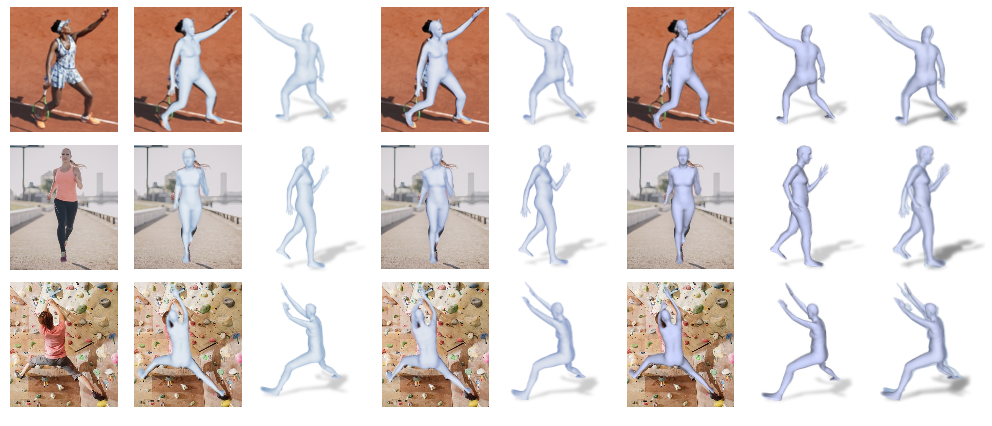
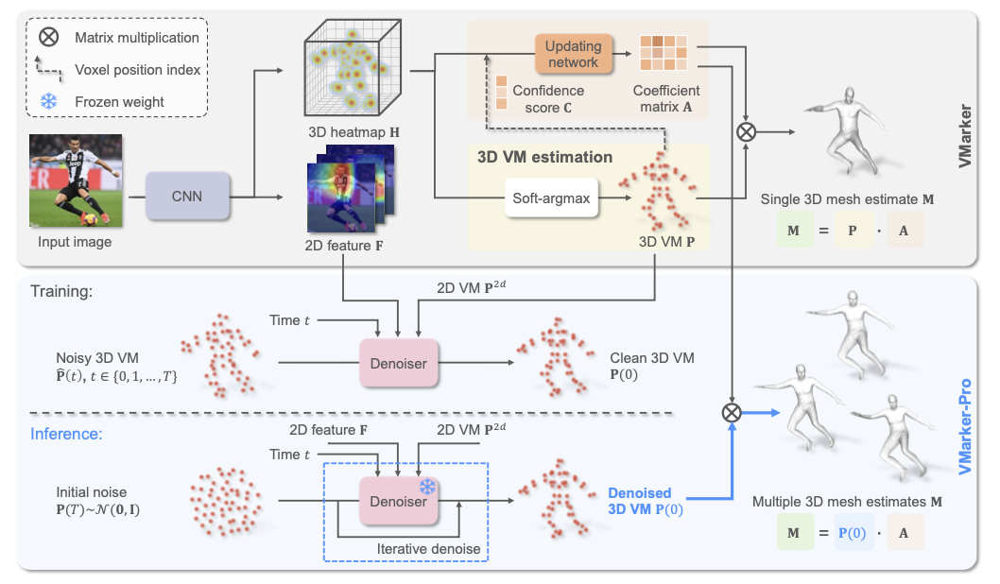

<div align="center">

  <h1 align="center">VMarker-Pro: Probabilistic 3D Human Mesh Estimation from Virtual Markers</h1>
  
</div>

<div align="left">

  <a></a>
  <a href="https://pytorch.org/get-started/locally/"></a>
  <a href="https://github.com/ShirleyMaxx/VMarker-Pro/blob/main/LICENSE">![License](https://img.shields.io/github/license/metaopt/torchopt?label=license&logo=data:image/svg+xml;base64,PHN2ZyB4bWxucz0iaHR0cDovL3d3dy53My5vcmcvMjAwMC9zdmciIHZpZXdCb3g9IjAgMCAyNCAyNCIgd2lkdGg9IjI0IiBoZWlnaHQ9IjI0IiBmaWxsPSIjZmZmZmZmIj48cGF0aCBmaWxsLXJ1bGU9ImV2ZW5vZGQiIGQ9Ik0xMi43NSAyLjc1YS43NS43NSAwIDAwLTEuNSAwVjQuNUg5LjI3NmExLjc1IDEuNzUgMCAwMC0uOTg1LjMwM0w2LjU5NiA1Ljk1N0EuMjUuMjUgMCAwMTYuNDU1IDZIMi4zNTNhLjc1Ljc1IDAgMTAwIDEuNUgzLjkzTC41NjMgMTUuMThhLjc2Mi43NjIgMCAwMC4yMS44OGMuMDguMDY0LjE2MS4xMjUuMzA5LjIyMS4xODYuMTIxLjQ1Mi4yNzguNzkyLjQzMy42OC4zMTEgMS42NjIuNjIgMi44NzYuNjJhNi45MTkgNi45MTkgMCAwMDIuODc2LS42MmMuMzQtLjE1NS42MDYtLjMxMi43OTItLjQzMy4xNS0uMDk3LjIzLS4xNTguMzEtLjIyM2EuNzUuNzUgMCAwMC4yMDktLjg3OEw1LjU2OSA3LjVoLjg4NmMuMzUxIDAgLjY5NC0uMTA2Ljk4NC0uMzAzbDEuNjk2LTEuMTU0QS4yNS4yNSAwIDAxOS4yNzUgNmgxLjk3NXYxNC41SDYuNzYzYS43NS43NSAwIDAwMCAxLjVoMTAuNDc0YS43NS43NSAwIDAwMC0xLjVIMTIuNzVWNmgxLjk3NGMuMDUgMCAuMS4wMTUuMTQuMDQzbDEuNjk3IDEuMTU0Yy4yOS4xOTcuNjMzLjMwMy45ODQuMzAzaC44ODZsLTMuMzY4IDcuNjhhLjc1Ljc1IDAgMDAuMjMuODk2Yy4wMTIuMDA5IDAgMCAuMDAyIDBhMy4xNTQgMy4xNTQgMCAwMC4zMS4yMDZjLjE4NS4xMTIuNDUuMjU2Ljc5LjRhNy4zNDMgNy4zNDMgMCAwMDIuODU1LjU2OCA3LjM0MyA3LjM0MyAwIDAwMi44NTYtLjU2OWMuMzM4LS4xNDMuNjA0LS4yODcuNzktLjM5OWEzLjUgMy41IDAgMDAuMzEtLjIwNi43NS43NSAwIDAwLjIzLS44OTZMMjAuMDcgNy41aDEuNTc4YS43NS43NSAwIDAwMC0xLjVoLTQuMTAyYS4yNS4yNSAwIDAxLS4xNC0uMDQzbC0xLjY5Ny0xLjE1NGExLjc1IDEuNzUgMCAwMC0uOTg0LS4zMDNIMTIuNzVWMi43NXpNMi4xOTMgMTUuMTk4YTUuNDE4IDUuNDE4IDAgMDAyLjU1Ny42MzUgNS40MTggNS40MTggMCAwMDIuNTU3LS42MzVMNC43NSA5LjM2OGwtMi41NTcgNS44M3ptMTQuNTEtLjAyNGMuMDgyLjA0LjE3NC4wODMuMjc1LjEyNi41My4yMjMgMS4zMDUuNDUgMi4yNzIuNDVhNS44NDYgNS44NDYgMCAwMDIuNTQ3LS41NzZMMTkuMjUgOS4zNjdsLTIuNTQ3IDUuODA3eiI+PC9wYXRoPjwvc3ZnPgo=)</a>

</div>


<p align="center">
  
</p>


## Introduction

This is the offical [Pytorch](https://pytorch.org/) implementation of our paper:
<h3 align="center">VMarker-Pro: Probabilistic 3D Human Mesh Estimation from Virtual Markers</h3>

<h4 align="center" style="text-decoration: none;">
  <a href="https://shirleymaxx.github.io/", target="_blank"><b>Xiaoxuan Ma</b></a>
  ,
  <a href="https://scholar.google.com/citations?user=DoUvUz4AAAAJ&hl=en", target="_blank"><b>Jiajun Su</b></a>
  ,
  <a href="https://xy02-05.github.io/", target="_blank"><b>Yuan Xu</b></a>
  ,
  <a href="https://wentao.live/", target="_blank"><b>Wentao Zhu</b></a>
  ,
  <a href="https://www.chunyuwang.org/", target="_blank"><b>Chunyu Wang</b></a>
  ,
  <a href="https://cfcs.pku.edu.cn/english/people/faculty/yizhouwang/index.htm", target="_blank"><b>Yizhou Wang</b></a>

</h4>

It is an extension for [VMaker (CVPR 2023)](https://github.com/ShirleyMaxx/VirtualMarker) by integrating VMarker with probabilistic modeling.

Below is the overall VMarker-Pro framework.

<p align="center">
   
</p>


## Code will be coming soon ... Stay tuned!


<!-- ## Citation
Cite as below if you find this repository is helpful to your project:
```bibtex
@article{ma20233d,
  title={VMarker-Pro: Probabilistic 3D Human Mesh Estimation from Virtual Markers},
  author={Ma, Xiaoxuan and Su, Jiajun and Xu, Yuan and Zhu, Wentao and Wang, Chunyu and Wang, Yizhou},
  journal={arXiv preprint},
  year={2024}
}
``` -->


## Acknowledgement
This repo is built on the excellent work [Pose2Mesh](https://github.com/hongsukchoi/Pose2Mesh_RELEASE), [HybrIK](https://github.com/Jeff-sjtu/HybrIK), [CLIFF](https://github.com/haofanwang/CLIFF) and [LDM](https://github.com/CompVis/latent-diffusion). Thanks for these great projects.
